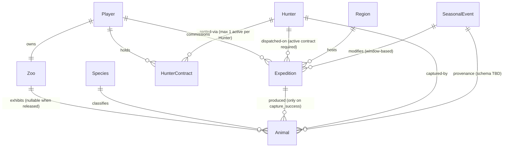

# WildLive — Minimal ER Model

- Status: Accepted (design only — no migrations, no models, no
  endpoints have been written from this document yet)
- Date: 2026-08-14
- Source of truth: [`docs/adr/0002-game-system-foundation.md`](adr/0002-game-system-foundation.md)

## Purpose

Translate the ratified WildLive game system (ADR-0002) into the
smallest PostgreSQL-shaped entity model that is sufficient for the
MVP-0 vertical slice:

```text
Player → Hunter → Expedition → Wait → Resolve → Animal → Zoo
```

This document is a **design contract**. Concrete columns, indexes,
triggers, and Laravel migrations belong to a follow-up task. The AI
must not create migrations from this document without a separate
human-approved task.

## Scope

- **Fixed here** — the entity set, relationships and cardinality, the
  transaction and concurrency boundaries that PostgreSQL must enforce,
  and which pieces of data are server-authoritative.
- **Left TBD here** — every game-design number, formula, algorithm,
  and content list that is still open in
  [`docs/DECISIONS_PENDING.md`](DECISIONS_PENDING.md). Those are
  called out in-line as `TBD` so a later task cannot accidentally
  treat a placeholder as ratified.

## Entities

Nine entities are introduced. Existing working notes in
`docs/DOMAIN_MODEL.md` used the name `User` for the account; this ER
model renames it to `Player` for parity with the game vocabulary. No
duplicate concept is being introduced.

| Entity            | Role                                                                                    | Introduced by        |
|-------------------|-----------------------------------------------------------------------------------------|----------------------|
| `Player`          | The account. Owns exactly one `Zoo`.                                                    | ADR-0002 §1          |
| `Zoo`             | The player's persistent collection surface.                                             | ADR-0002 §11–§13     |
| `Species`         | Global master data for a real-world animal species.                                     | ADR-0002 §3          |
| `Animal`          | A single captured individual, distinct from `Species`.                                  | ADR-0002 §4          |
| `Hunter`          | An NPC that can be contracted from the shared Guild pool.                               | ADR-0002 §6          |
| `HunterContract`  | Represents a `Player` currently holding a `Hunter` — enforces shared-scarce exclusivity.| ADR-0002 §7          |
| `Region`          | A place a `Hunter` can be dispatched to.                                                | ADR-0002 §8          |
| `Expedition`      | A time-bounded assignment of a `Hunter` to a `Region` for a `Player`.                   | ADR-0002 §9–§10      |
| `SeasonalEvent`   | A bounded-time modifier of appearance rates, rare-trait rates, or Region state.         | ADR-0002 §16, §18    |

### Guild is not a separate entity yet

ADR-0002 §7 speaks of the *Guild* as the source of contractable
Hunters. The current model treats "the Guild pool" as the implicit
set of all `Hunter` rows; the shared-scarce rule is enforced through
`HunterContract`, not through a `Guild` table. If a future decision
introduces multiple Guilds or Guild-scoped rules, `Hunter` gains a
`guild_id` FK and a `Guild` table is added — additively, without
breaking anything defined here.

### Currency (`G`) is not modelled here yet

ADR-0002 §14 fixes the currency name (`G`) but leaves every price and
every generation formula open (`Hunter contract prices`, `Visitor →
G` formula). Because no `G`-affecting rule is decided, this ER model
does **not** introduce a `Wallet` or a `GLedger` entity. When the
economy formulas land, a `Wallet` (per `Player`) and an append-only
`GLedger` (per motion) can be added without disturbing anything
below. Recording that gap here is deliberate; a future migration
task must not assume `G` is already tracked.

## Diagram



## Relationships and cardinality

| Left            | Card. | Right           | Notes                                                                                   |
|-----------------|-------|-----------------|-----------------------------------------------------------------------------------------|
| `Player`        | 1..1  | `Zoo`           | Enforced by `UNIQUE(Zoo.player_id) NOT NULL`. Zoo is created in the same transaction as the Player. |
| `Zoo`           | 1..N  | `Animal`        | `Animal.zoo_id NULLABLE` — a released Animal has `zoo_id = NULL` (and `status = 'released'`). |
| `Species`       | 1..N  | `Animal`        | `Animal.species_id NOT NULL`. `Species` is seed data.                                   |
| `Player`        | 1..N  | `HunterContract`| A player may hold many contracts over time. Active-vs-historical is distinguished by `ended_at IS NULL`. |
| `Hunter`        | 1..N  | `HunterContract`| A hunter may have many *historical* contracts, but **at most one active** (see concurrency rule below). |
| `Player`        | 1..N  | `Expedition`    | Standard FK.                                                                            |
| `Hunter`        | 1..N  | `Expedition`    | Standard FK. Business rule: `Expedition` may only be created when the `Player` currently holds an active `HunterContract` for the `Hunter`. |
| `Region`        | 1..N  | `Expedition`    | Standard FK.                                                                            |
| `Expedition`    | 1..N  | `Animal`        | Zero when `outcome = 'no_capture'`. One or more when `outcome = 'capture_success'`. Whether the count can exceed one is TBD (see §Open questions). |
| `Hunter`        | 1..N  | `Animal`        | Redundant with `Expedition.hunter_id`, but recorded on `Animal` so provenance survives changes to `Expedition` structure. |
| `SeasonalEvent` | 1..N  | `Expedition`    | Optional. `Expedition.seasonal_event_id NULLABLE`. Whether an expedition can be tagged with more than one concurrent event is TBD. |
| `SeasonalEvent` | 1..N  | `Animal`        | Optional provenance link. **Schema TBD** — the exact way an Animal records "captured during Winter Wilds 2026" is a human game-design decision (ADR-0002 §18). This model reserves the *relationship* only; the field name and multiplicity are not fixed here. |

Whether `HunterContract → Expedition` is a real FK (one contract can
produce many expeditions? exactly one expedition per contract?) is
**TBD** — it depends on the still-open Hunter-contract-duration
decision. The concurrency rule below does not depend on that
question.

## Concurrency and transaction boundaries

The following are the concurrency-sensitive relationships the future
schema must protect. Only invariants are described; specific SQL
(unique partial indexes, `SELECT … FOR UPDATE`, advisory locks) is
left to the migration task.

### C1. `Player → Zoo` is 1:1

Two rows referencing the same `player_id` in `Zoo` must be
impossible. Player creation and Zoo creation must run in one
transaction so a Player never exists without a Zoo (or vice versa).

### C2. `Hunter` has at most one active `HunterContract`

At any point in time, at most one `HunterContract` for a given
`hunter_id` may have `ended_at IS NULL`. Two concurrent attempts to
contract the same Hunter must have exactly one winner. This is the
shared-scarce-Hunter invariant from ADR-0002 §7.

Enforcement candidates (choice deferred to migration task): a
`UNIQUE(hunter_id) WHERE ended_at IS NULL` partial index, a
transactional advisory lock keyed on `hunter_id`, or a `SELECT …
FOR UPDATE` on the `Hunter` row inside the contract-creation
transaction. The chosen mechanism must fail closed under contention.

### C3. `Expedition.resolved_at` is set exactly once

Expedition resolution is idempotent (ADR-0002 §10;
[`docs/ARCHITECTURE.md`](ARCHITECTURE.md) *Idempotency* section).
Concretely:

1. Any resolver (lazy player-triggered, scheduled scan, dependent
   process) opens a transaction and locks the `Expedition` row.
2. If `resolved_at IS NOT NULL`, the resolver returns the existing
   outcome; it does not re-run the outcome logic.
3. Otherwise it computes the outcome server-side, inserts any
   `Animal` rows in the same transaction, sets `resolved_at` and
   `outcome`, and commits.

A CHECK constraint should tie the two together:
`(resolved_at IS NULL AND outcome IS NULL) OR (resolved_at IS NOT NULL AND outcome IN (…))`.

### C4. `Animal` insertion is bound to the resolving transaction

An `Animal` row is only ever created inside the resolution
transaction of its `source_expedition_id`. This means every `Animal`
has a verifiable provenance chain: `Animal → Expedition → Hunter`
and `Animal → Species`.

### C5. `Expedition` may only be created against an active contract

The Expedition-creation transaction must verify that a
`HunterContract` exists for `(player_id, hunter_id)` with
`ended_at IS NULL`, and take the same lock (see C2) so a Hunter
cannot be dispatched while their contract is being torn down. Whether
this is expressed as a compound FK or as a runtime check is left to
the migration task, but the invariant is non-negotiable.

## Lifecycle

| Entity            | Creation                                            | Mutation                                                            | Retirement / terminal state                                          |
|-------------------|-----------------------------------------------------|---------------------------------------------------------------------|----------------------------------------------------------------------|
| `Player`          | On registration (auth method TBD)                   | Display name and profile fields (TBD)                               | Account deletion policy TBD                                          |
| `Zoo`             | In same tx as owning `Player`                       | Player-editable name (TBD)                                          | Only if the owning `Player` is deleted                               |
| `Species`         | Seed data (loading pipeline TBD)                    | Rare — corrections only                                             | Not deleted; may be marked deprecated (TBD)                          |
| `Animal`          | Only inside `Expedition` resolution tx              | `player_assigned_name`, `status` (`in_zoo` ⇄ `released`)            | Not deleted; `status='released'` sets `zoo_id = NULL`                |
| `Hunter`          | Seeded / server-generated (algorithm TBD)           | Server-authoritative refresh of availability (TBD)                  | Not deleted while historical contracts / expeditions reference them  |
| `HunterContract`  | Player action, inside C2 transaction                | Immutable other than setting `ended_at`                             | Terminal when `ended_at IS NOT NULL`                                 |
| `Region`          | Seed data (names, count, unlock model all TBD)      | Rare — content edits                                                | Not deleted while historical `Expedition` rows reference them        |
| `Expedition`      | Player action, once the C5 check passes             | `resolved_at`, `outcome` set once (C3). Fixed otherwise.            | Terminal when `resolved_at IS NOT NULL`                              |
| `SeasonalEvent`   | Ops action (cadence TBD)                            | Bounded by `starts_at` / `ends_at`; formula fields TBD              | Terminal after `ends_at`; row is retained for `Animal` provenance    |

## Immutable vs. mutable data

**Immutable after creation** (write-once):

- `Player.id`, `Player.created_at`
- `Zoo.player_id`, `Zoo.created_at`
- `Species.id` (business `code`/`slug` may be immutable too — TBD)
- `Animal.id`, `Animal.species_id`, `Animal.source_expedition_id`,
  `Animal.captured_by_hunter_id`, `Animal.captured_at`
- `Hunter.id`
- `HunterContract.id`, `HunterContract.player_id`,
  `HunterContract.hunter_id`, `HunterContract.started_at`
- `Region.id`
- `Expedition.id`, `Expedition.player_id`, `Expedition.hunter_id`,
  `Expedition.region_id`, `Expedition.started_at`,
  `Expedition.ends_at`
- `SeasonalEvent.id`, `SeasonalEvent.starts_at`,
  `SeasonalEvent.ends_at`

**Set-once**:

- `HunterContract.ended_at`
- `Expedition.resolved_at`, `Expedition.outcome`

**Player-mutable**:

- `Animal.player_assigned_name`
- `Animal.status` (`in_zoo` ⇄ `released`, with the side-effect on
  `zoo_id` described above)
- Zoo cosmetic fields (name, ordering, notes) — schema TBD

**Server-mutable**:

- `Hunter` availability metadata (rules TBD)
- Any denormalised aggregates (Zoo Value, Visitor counts) — whether
  these are materialised or computed on demand is TBD

## Server-authoritative data

The client is never trusted for any of the following (ADR-0002 §1 and
`docs/GUARDRAILS.md#game-fairness`):

- Every timestamp: `started_at`, `ends_at`, `resolved_at`, event
  window boundaries, contract windows.
- `Expedition.outcome` and every `Animal` produced from it.
- `Species` rarity and appearance-rate tables (when they exist).
- `HunterContract` acceptance decisions and the availability rule
  behind them.
- Any future `Zoo Value`, `Visitor`, and `G` value.
- `SeasonalEvent` activation, deactivation, and per-event modifiers.

## Fields clearly required by the current game design

Only fields whose necessity is unambiguously fixed by ADR-0002 are
listed. Type widths, nullability defaults, and index choices are
migration-task decisions.

- **`Player`** — `id`, `created_at`.
- **`Zoo`** — `id`, `player_id (unique, not null)`, `created_at`.
- **`Species`** — `id`, `common_name`.
- **`Animal`** — `id`, `species_id`, `zoo_id (nullable)`,
  `status`, `source_expedition_id`, `captured_by_hunter_id`,
  `captured_at`, optional `seasonal_event_id (nullable)`,
  optional `player_assigned_name (nullable)`.
- **`Hunter`** — `id`.
- **`HunterContract`** — `id`, `player_id`, `hunter_id`,
  `started_at`, `ended_at (nullable)`.
- **`Region`** — `id`.
- **`Expedition`** — `id`, `player_id`, `hunter_id`, `region_id`,
  `started_at`, `ends_at`, `resolved_at (nullable)`,
  `outcome (nullable enum: 'capture_success' | 'no_capture')`,
  optional `seasonal_event_id (nullable)`.
- **`SeasonalEvent`** — `id`, `starts_at`, `ends_at`.

## Fields deliberately TBD (do not decide in the migration task)

These remain in [`docs/DECISIONS_PENDING.md`](DECISIONS_PENDING.md).
The migration task must not fabricate values or column names for
them.

- Full 120-species list; the `Species` `code`/`slug` / scientific
  name / rarity taxonomy columns.
- Concrete Region names, count, and unlock model — hence `Region`
  currently has only `id`.
- Full `Hunter` attribute schema (tier, luck, specialisation,
  stamina/injury) and any denormalised `is_available` flag.
- Guild pool availability / regeneration algorithm.
- `HunterContract` price schema, duration schema, cooldown.
- Whether `HunterContract → Expedition` is 1:1 or 1:N, and whether an
  explicit `hunter_contract_id` FK belongs on `Expedition`.
- Per-individual `Animal` attribute schema (sex, weight, body-size
  units, rare-trait catalog, rarity scoring).
- `Expedition.outcome` extensions beyond the two coarse values
  (partial success, injury) and cancellation support.
- `SeasonalEvent` content, cadence, formula fields.
- `Animal` seasonal / event provenance schema — the *relationship*
  is reserved (see the diagram), but the exact field(s) and
  multiplicity are open.
- The entire currency (`G`) subsystem — `Wallet`, `GLedger`, and
  every earn/spend rule.
- Authentication method, public player identity, and any related
  columns on `Player`.
- Whether World First is retained as a mechanic (and if yes, whether
  it lives as a per-`Species` first-capture pointer or as its own
  entity).
- Trading / cooperative-expedition / anti-abuse concerns.

## Open questions specifically raised by this ER model

These are new questions this design has surfaced. They belong in
`docs/DECISIONS_PENDING.md` and must be resolved before a
migration is written:

- `Expedition.outcome` — should it store the coarse enum only, or
  a richer JSON payload that captures the resolution reasoning?
- `Animal.status` — can it move back and forth (`released` →
  `in_zoo`) once released? Current default assumption is *no* (one
  way), but ADR-0002 does not settle this.
- Should `SeasonalEvent` have a numeric `code`, a stable `slug`,
  both, or neither? (Depends on how ops schedules events.)
- Should `HunterContract` carry a denormalised `is_active`
  column, or should `ended_at IS NULL` remain the sole source of
  truth?
- When `Animal` is released, is the `zoo_id` set to `NULL` and the
  row kept, or is the row deleted? Current default assumption is
  *kept* so provenance and Zoo Value history are preserved, but this
  is a game-feel decision the human should confirm.

## Explicit non-goals of this document

- No SQL, no CREATE TABLE, no Laravel migration.
- No Eloquent model, no factory, no seeder, no controller, no route.
- No REST API contract.
- No JSON schema for `Animal.traits` or `SeasonalEvent` payload.
- No pricing, formula, or algorithm.
- No decision about authentication.
- No game-fairness balancing.

Any of the above requires its own task and its own approval.
